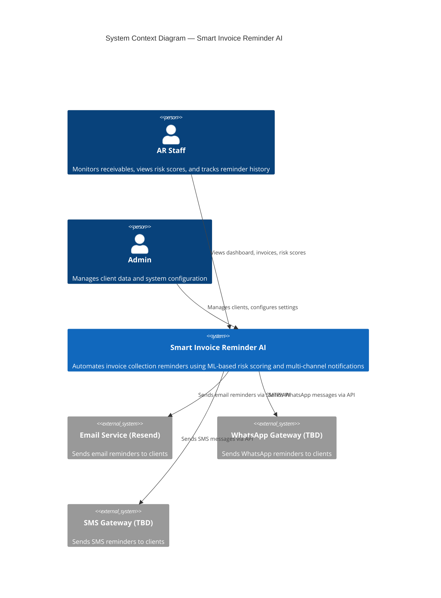
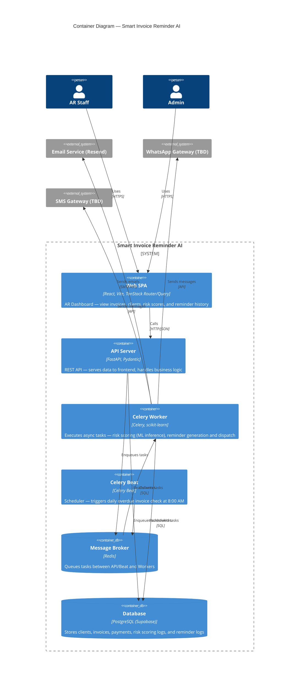
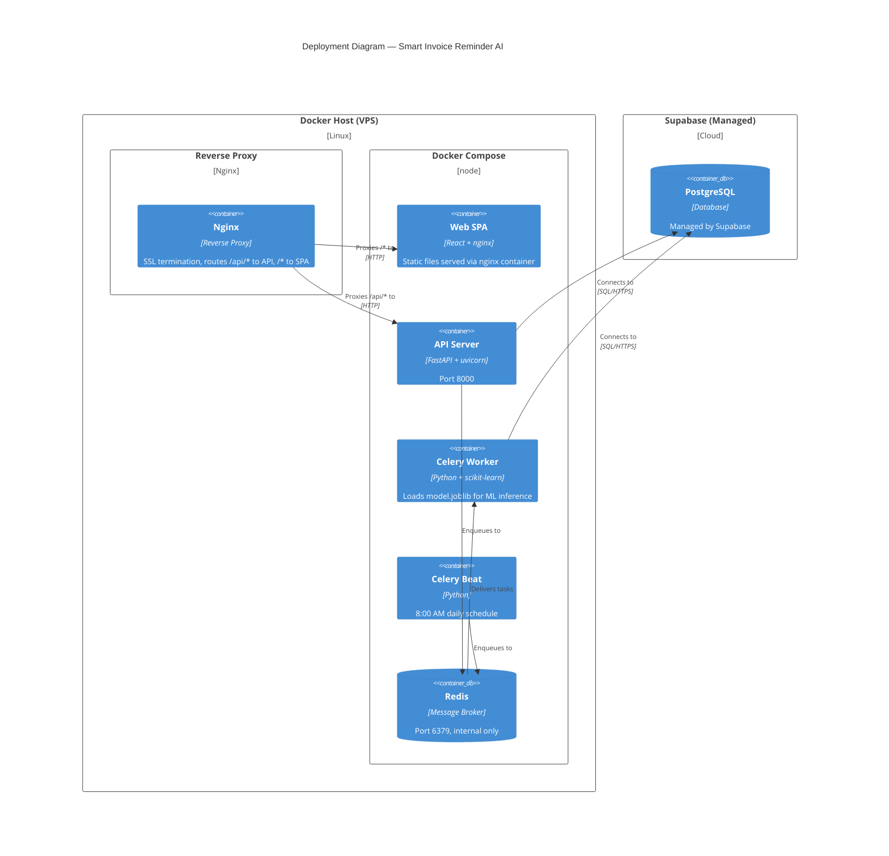

# System Architecture

This section describes the system architecture of Smart Invoice Reminder AI using the [C4 model](https://c4model.com/). We present two levels of abstraction — System Context (C1) and Container (C2) — followed by a Deployment diagram showing how the system maps to infrastructure.

## C1 — System Context Diagram

The context diagram shows Smart Invoice Reminder AI as a single system, along with the people who use it and the external systems it interacts with.

### Description

- **AR Staff** is the primary user. They use the web dashboard to monitor overdue invoices, review client risk levels, and track reminder delivery status.
- **Admin** manages client data (company info, contact details) and system configuration.
- **Smart Invoice Reminder AI** is the core system. It runs daily automated checks for overdue invoices, scores each client's payment risk using a trained ML model, and dispatches personalized reminders through the appropriate channel.
- **External notification services** handle the actual delivery of reminders. Email uses Resend (SMTP). WhatsApp and SMS providers are to be determined.

## C2 — Container Diagram

The container diagram zooms into the system and shows the major deployable units, their technologies, and how they communicate.

### Description

| Container | Technology | Responsibility |
|-----------|-----------|----------------|
| **Web SPA** | React 19, Vite, TanStack Router/Query, Tailwind CSS | AR Dashboard — single-page application for viewing invoices, clients, risk scores, and reminder history |
| **API Server** | FastAPI, Pydantic, uvicorn | REST API — serves data to the frontend, handles authentication, and delegates async work to workers |
| **Celery Worker** | Celery, scikit-learn | Executes background tasks: loads the trained ML model in-process to score client risk, generates reminder messages based on risk level, and dispatches them via external services |
| **Celery Beat** | Celery Beat | Cron-like scheduler that triggers the daily overdue invoice check at 8:00 AM |
| **Message Broker** | Redis | Mediates communication between the API/Beat (producers) and Workers (consumers) via task queues |
| **Database** | PostgreSQL (Supabase) | Persistent storage for all domain data across 5 tables: `clients`, `invoices`, `payments`, `risk_scoring_logs`, `reminder_logs` |

### Key Design Decisions

- **ML model runs inside the Celery Worker**, not as a separate service. A trained scikit-learn model is lightweight (a few MB `.joblib` file), so it loads directly into the worker process for inference. No GPU or external ML server required.
- **Celery Beat is a separate container** from the worker to follow the single-responsibility principle — Beat only schedules, Workers only execute.
- **Redis serves as the message broker** between Beat/API and Workers. It is internal-only and not exposed publicly.
- **Supabase provides managed PostgreSQL** with built-in auth capabilities, reducing infrastructure overhead.

### Data Flow — Daily Reminder Cycle

1. **Celery Beat** triggers the `check_overdue` task at 8:00 AM daily
2. **Celery Worker** picks up the task, queries the **Database** for overdue invoices
3. For each overdue invoice, the worker loads the **ML model** and predicts the client's payment probability
4. Based on the probability score, a risk label is assigned (LOW / MEDIUM / HIGH) and logged to `risk_scoring_logs`
5. The risk label determines the reminder tone: LOW → SOPAN (polite), MEDIUM → TEGAS (firm), HIGH → PERINGATAN (warning)
6. The worker checks `reminder_logs` to prevent duplicate same-day sends
7. If no duplicate exists, the worker generates the reminder message and dispatches it via the appropriate **notification service** (Email, WhatsApp, or SMS)
8. Delivery status is recorded in `reminder_logs`

## Deployment Diagram

The deployment diagram shows how containers are mapped to infrastructure.

### Description

- **All application containers** (SPA, API, Worker, Beat, Redis) run on a single VPS via `docker-compose.yml` with `restart: unless-stopped`.
- **Nginx reverse proxy** sits in front of the application, handling SSL termination and routing: `/api/*` routes to the API Server, all other paths serve the React SPA.
- **Supabase is managed externally** — the database is not hosted on the VPS. The API and Workers connect to it over HTTPS.
- **The ML model file** (`model.joblib`) is bundled into the Worker's Docker image at build time. When a new model is trained, the image is rebuilt and redeployed.
- **Redis is internal-only** — bound to the Docker network, not exposed to the public internet.
